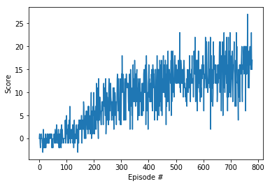

[//]: # (Image References)

[image1]: https://user-images.githubusercontent.com/10624937/42135619-d90f2f28-7d12-11e8-8823-82b970a54d7e.gif "Trained Agent"

# Project 1: Navigation

### Project details

For this project, we will look at the banana gathering task in which an autonomous robot learns to navigate a square environment, collecting yellow bananas, while avoiding blue bananas.  The state consists of a 37-dimensional space that corresponds to the agents velocity and ray-based perception of objects in the agent's field of view.  The agent can choose from four discrete actions: Move forwards, move backwards, turn left, and turn right.  The agent received a reward of +1 every time it collects a yellow banana, and a reward of -1 every time it collects a blue banana.  The task is considered solved when the weights allow the agent to get an average score of at least 13, over 100 consecutive episodes.

This project's implementation requires no additional dependencies beyond that specified by the project specification (Unity ml agents, openai gym, pytorch, etc).

Training the agent requires running codebox 4 of the jupyter notebook (it is self-sufficient and may, in fact, not work if the previous codeblocks are run).  The notebook requires the included dqn_agent.py and model.py python files.

### Model

The model consists of 5 fully-connected layers.  All by the last of the layers is run through a ReLU unit for non-linearity.  The first layer takes the state input and produces a hidden layer of 64 nodes, the second layer takes those inputs and produces 256 nodes, the third layer takes those inputs and produces another 256 nodes, the fourth layer takes those inputs and produces 64 nodes, and the final layer takes those inputs and produces 4 nodes corresponding to the four possible actions.

### Learning algorithm

To learn the correct parameters for this model, we employed the same general approach as the DQN model.  For a period of up to 2000 episodes, we execute the model, and update its parameters as we evaluate by applying the temporal difference model.  Each episode is limited to a maximum of 1000 steps, though this is rarely hit.

At each iteration, we use epsilon-greedy action selection with epsilon initially 1.0 and decaying by 0.5% each episode, until it reaches 0.01, at which point it's held stable.  This action is applied and the next state and reward are retrieved.

In the DQN we compute the difference between the target value of the current state and action to the value estimated by the current set of parameters, and using that squared loss in a gradient descent algorithm.

The original DQN calculates the target value by taking the most recent reward and adding a discounted (in our case, with gamma 0.99) evaluation of the next_state with it's current optimal action, using a fixed set of parameters (that only update every 4 updates).  We take this one step further and implement the Dual DQN algorithm.  In this case, we select the optimal action using the non-fixed weights in order to decorrelate the weights used for the optimal action selection (for the next state) and the weights used to evaluate the Q value for that state-action pair.  The MSE loss is then sent to an Adam optimizer with a learning rate of 5e-4.

Using this model and learning algorithm we were able to get an average reward of over 15 (due to a typo, we aimed for a more aggressive target :)) over episodes 680-780, well below the benchmark implementation.  See below:

### Future work

As described above, this implementation only used the Dual DQN addition. I would like to try adding prioritized experience reply and Dueling DQN to see further training improvements.  I would also like to try reducing the model complexity to see if a lower-capacity model could attain the required results, at a lower inference cost.  Finally, I would like to try the "From Pixels" implementation to see how quickly one could train an effective model that uses only images to navigate the environment.